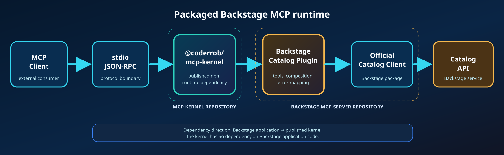

# Backstage MCP Server

A type-safe Model Context Protocol server for the Backstage Software Catalog, built on the published `@coderrob/mcp-kernel` runtime.

It exposes 32 Catalog tools over stdio, uses Backstage's official Catalog client, supports rotating bearer credentials, and ships with black-box SDK and MCP Inspector verification.



## What you get

| Capability          | Implementation                                                                          |
| ------------------- | --------------------------------------------------------------------------------------- |
| Catalog discovery   | Entity queries, references, ancestry, facets, and source locations                      |
| Catalog operations  | Add locations, refresh entities, remove entities or locations, and validate descriptors |
| Type safety         | Zod schemas infer handler inputs and emit MCP-compatible JSON Schemas                   |
| Runtime policies    | Timeouts, caller scopes, per-principal rate limits, tagged caching, and invalidation    |
| Safe operations     | MCP annotations distinguish read-only, mutating, idempotent, and destructive tools      |
| Production boundary | Official Backstage `CatalogClient`, authenticated fetch, redacted stderr logging        |
| Verification        | Per-file coverage, SDK stdio smoke tests, every-tool execution, and MCP Inspector       |

## Quick start

### 1. Install and build

Requirements:

- Node.js 24.15 or newer
- Corepack
- A reachable Backstage backend and an accepted external-access bearer token

```bash
corepack enable
corepack yarn install --immutable
corepack yarn build
```

The Yarn release comes from the `packageManager` field in `package.json`; use `corepack yarn` so local and CI behavior stay aligned.

### 2. Configure Backstage

Set the backend root or the complete Catalog plugin URL and choose one credential source:

```bash
export BACKSTAGE_BASE_URL=https://backstage.example.com
export BACKSTAGE_TOKEN=your-token
```

For externally rotated credentials, point to a token file instead:

```bash
export BACKSTAGE_BASE_URL=https://backstage.example.com
export BACKSTAGE_TOKEN_FILE=/run/secrets/backstage-token
```

`BACKSTAGE_TOKEN_FILE` takes precedence when both variables are present and is reread for every outgoing request. Optional `LOG_LEVEL=debug` enables diagnostic logging. Logs always go to stderr because stdout carries MCP protocol traffic.

### 3. Start the stdio server

```bash
corepack yarn start
```

The process waits for an MCP client on stdin/stdout. For a read-only check against a real deployment, use `corepack yarn test:live`; see [live Backstage verification](docs/testing/mcp-end-to-end-testing.md#testing-a-real-backstage-deployment).

## Connect an MCP client

After building, configure a stdio client with an absolute path:

```json
{
  "mcpServers": {
    "backstage": {
      "command": "node",
      "args": ["/absolute/path/to/backstage-mcp-server/dist/cli.cjs"],
      "env": {
        "BACKSTAGE_BASE_URL": "https://backstage.example.com",
        "BACKSTAGE_TOKEN": "your-token"
      }
    }
  }
}
```

After global installation, use `backstage-mcp-server` as the command. Do not place credentials in committed client configuration; use the client's secret or environment mechanism where available.

## Tool catalog

The checked-in [`tools-manifest.json`](tools-manifest.json) is generated from the runtime definitions and is the machine-readable source of truth.

| Category             | Tools                                                                                                                             |
| -------------------- | --------------------------------------------------------------------------------------------------------------------------------- |
| Entity discovery     | `get_entities`, `get_entities_by_query`, `get_entities_by_refs`, `get_entity_by_ref`, `get_entity_ancestors`, `get_entity_facets` |
| Location discovery   | `get_location_by_entity`, `get_location_by_ref`                                                                                   |
| Validation           | `validate_entity`                                                                                                                 |
| Catalog mutation     | `add_location`, `refresh_entity`                                                                                                  |
| Destructive mutation | `remove_entity_by_uid`, `remove_location_by_id`                                                                                   |

`get_entities.filter` follows Backstage's key-value model: keys in one record are AND conditions, values for one key are OR conditions, and multiple records are OR groups.

```json
{
  "filter": {
    "kind": ["Component", "API"],
    "metadata.namespace": "default"
  }
}
```

This selects Components or APIs in the `default` namespace. The [Backstage integration guide](docs/integrations/backstage-catalog.md) documents every tool-to-client mapping, cursor behavior, authentication, permissions, and error conversion.

## How it works

1. An MCP client launches the packaged CLI and exchanges JSON-RPC over stdio.
2. The published MCP Kernel validates and compiles immutable feature definitions.
3. Zod validates input before middleware, authorization, caching, rate limiting, and timeout policies run.
4. A Backstage tool calls the typed Catalog contract from its application context.
5. The adapter delegates HTTP behavior to the official Backstage `CatalogClient` and injects the bearer token at the fetch boundary.
6. Results return as MCP text plus structured content; expected failures use stable error codes and safe details.

The published [`@coderrob/mcp-kernel`](https://www.npmjs.com/package/@coderrob/mcp-kernel) package owns protocol registration, lifecycle, policies, transports, testing support, and protocol-safe logging. This repository owns only the Backstage application and Catalog integration. See the [current architecture overview](docs/architecture/overview.md) for the dependency boundary.

## MCP Kernel dependency

Generic server authoring, lifecycle, policies, transports, results, testing support, and logging are documented in the [`@coderrob/mcp-kernel` repository](https://github.com/Coderrob/mcp-kernel). This package re-exports the kernel API for compatibility, but new generic consumers should install and import `@coderrob/mcp-kernel` directly.

To contribute a Catalog capability, follow [Adding a Backstage MCP tool](docs/development/adding-tools.md).

## Verification


Run the normal contributor gate:

```bash
corepack yarn lint
corepack yarn typecheck
corepack yarn architecture:check
corepack yarn knip
corepack yarn test
corepack yarn test:shell
```

For MCP, tool, adapter, or packaging changes, also run:

```bash
corepack yarn test:mcp
corepack yarn manifest:check
```

`test:mcp` runs contract tests, builds the distribution, launches `dist/cli.cjs` over stdio with the official SDK client, invokes every registered tool against a deterministic authenticated Catalog stub, and performs an independent MCP Inspector check. It does not bypass the server with direct handler or HTTP calls.

See [Repository tooling](docs/development/repository-tooling.md) for the purpose and side effects of every command and [MCP end-to-end testing](docs/testing/mcp-end-to-end-testing.md) for the exact black-box boundary.

## Documentation

Choose a path from the [documentation hub](docs/README.md):

- **Operate it:** [Backstage integration](docs/integrations/backstage-catalog.md) and [end-to-end testing](docs/testing/mcp-end-to-end-testing.md)
- **Develop it:** [Repository tooling](docs/development/repository-tooling.md), [code quality](docs/development/code-quality.md), and [adding tools](docs/development/adding-tools.md)
- **Understand it:** [Architecture overview](docs/architecture/overview.md), [ADRs](docs/adr/README.md), historical [analysis](docs/architecture/mcp-architecture-analysis.md), and [implementation plan](docs/plans/mcp-update.md)
- **Maintain it:** [Dependency management](docs/dependencies/README.md)

## License

GPL-3.0. See [`LICENSE`](LICENSE).

## Curated knowledge and skills

The [Backstage knowledge base](docs/knowledge/README.md) maintains classified articles, named source citations and schema.org metadata. Repository skills in `.agents/skills` support catalog lookups, entity maintenance and MCP development.

The 19 [contextual lookup tools](docs/knowledge/lookup-recipes.md) cover names, System and Domain contents, Groups, ownership, dependencies, APIs, annotations and orphaned entities. See [lookup contracts and examples](docs/knowledge/lookup-recipes.md), including pagination, ambiguity and work bounds.
