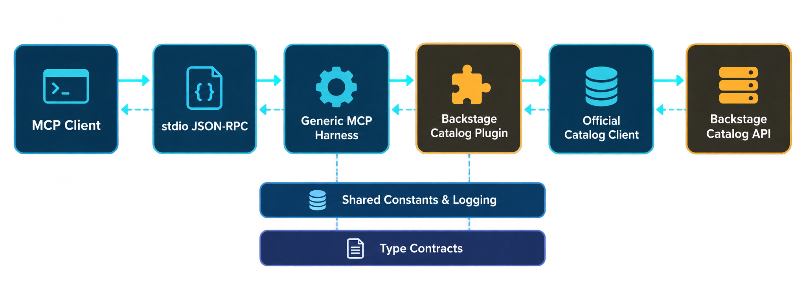

# Architecture overview

This page describes the current runtime, source boundaries, and lifecycle. For the historical assessment that motivated the generic harness, see the [architecture analysis](mcp-architecture-analysis.md). For durable trade-offs, use the [ADR index](../adr/README.md).



## Runtime in one sentence

The packaged CLI accepts MCP JSON-RPC over stdio, delegates protocol registration and policy enforcement to a generic application kernel, invokes schema-first Backstage tool definitions, and reaches Catalog through Backstage's official client.

## Component map

| Area                  | Responsibility                                                                                  | Start here                                          |
| --------------------- | ----------------------------------------------------------------------------------------------- | --------------------------------------------------- |
| Process entrypoint    | Reads environment, creates stderr logging, starts stdio, and handles shutdown signals           | [`src/cli.ts`](../../src/cli.ts)                    |
| Composition root      | Creates the authenticated Catalog adapter, Backstage context, middleware, and MCP application   | [`src/server.ts`](../../src/server.ts)              |
| Generic MCP kernel    | Owns definitions, registry validation, lifecycle, policies, results, middleware, and transports | [`src/mcp/`](../../src/mcp)                         |
| Backstage integration | Adapts the official Catalog client and composes Catalog tools into one plugin                   | [`src/backstage/`](../../src/backstage)             |
| Tool surface          | Defines one immutable, schema-first MCP tool per module                                         | [`src/backstage/tools/`](../../src/backstage/tools) |
| Shared infrastructure | Owns cross-cutting constants, error helpers, logging behavior, and validation                   | [`src/shared/`](../../src/shared)                   |
| Type contracts        | Groups reusable MCP, Backstage, CLI, logging, and authentication contracts                      | [`src/types/`](../../src/types)                     |

## Request path

1. An MCP client launches `dist/cli.cjs` and exchanges JSON-RPC over stdin/stdout.
2. `cli.ts` creates a logger that writes only to stderr, preserving stdout for protocol traffic.
3. `server.ts` composes the Backstage plugin, authenticated Catalog adapter, request logging, and stdio transport.
4. `McpApplication` asks the registry for its validated feature definitions and the SDK adapter registers them with `McpServer`.
5. The application validates tool input with Zod, creates request metadata and cancellation, and runs middleware and declarative policies.
6. The selected handler uses `BackstageMcpContext.catalogClient`; tool modules do not construct Catalog HTTP requests.
7. `BackstageCatalogApi` delegates routing and serialization to the official `CatalogClient`, while its fetch boundary injects the bearer credential.
8. The handler returns an MCP-native result. Expected failures become stable, safe error results; logs remain on stderr.

## Definition and registration model

Features are explicit immutable values. `defineTool`, `defineResource`, `defineResourceTemplate`, `definePrompt`, and `definePlugin` preserve schema-derived types without decorators, reflection, or a process-wide registry.

The registry validates names, plugin uniqueness, feature collisions, and tool policy constraints before the transport starts. `sdk-adapter.ts` is the only generic-kernel module that translates those definitions into the installed MCP SDK's registration API. Keeping that boundary narrow limits SDK upgrade work.

## Lifecycle and ownership

`createMcpServer` returns an isolated application instance with `start`, `stop`, `state`, `listFeatures`, and `manifest`.

- Startup creates the application context, runs plugin setup hooks in declaration order, creates the SDK server, registers compiled features, and connects the selected transport.
- Invocation links SDK and application cancellation, applies authorization, rate limiting, caching, invalidation, timeout, and middleware behavior, then calls the feature handler.
- Shutdown is idempotent. It closes the SDK server and disposes plugins and context in reverse ownership order.
- A startup failure rolls back resources that were already initialized.

## Dependency direction

The repository intentionally remains one package, but the source tree has extraction-ready boundaries:

```text
root entrypoints
  +-> backstage -> mcp
  +-> shared
  +-> types

mcp -> allowlisted domain-neutral shared modules and types
mcp -X-> backstage or application composition
```

`corepack yarn architecture:check` enforces the root-file policy, MCP boundary, colocated behavioral tests, colocated BATS tests, and absence of circular dependencies.

## Security boundaries

- The standalone server accepts either `BACKSTAGE_TOKEN` or a rotating `BACKSTAGE_TOKEN_FILE`; file-backed credentials take precedence.
- Credentials are added only at the Catalog fetch boundary and are redacted from structured logs.
- Tool annotations identify read-only, mutating, and destructive operations to MCP clients.
- Tool policies enforce local timeouts, per-principal cache isolation, rate limits, and cache invalidation.
- Unexpected errors expose a request identifier rather than raw upstream bodies or credentials.

See the [Backstage integration guide](../integrations/backstage-catalog.md) for authentication and endpoint behavior and the [end-to-end testing guide](../testing/mcp-end-to-end-testing.md) for proof of the complete process boundary.

## Making a change

- Add or modify a Catalog tool: [Adding a Backstage MCP tool](../development/adding-tools.md)
- Understand repository commands: [Repository tooling](../development/repository-tooling.md)
- Review enforced standards: [Code quality standards](../development/code-quality.md)
- Understand design rationale: [Architecture decisions](../adr/README.md)
