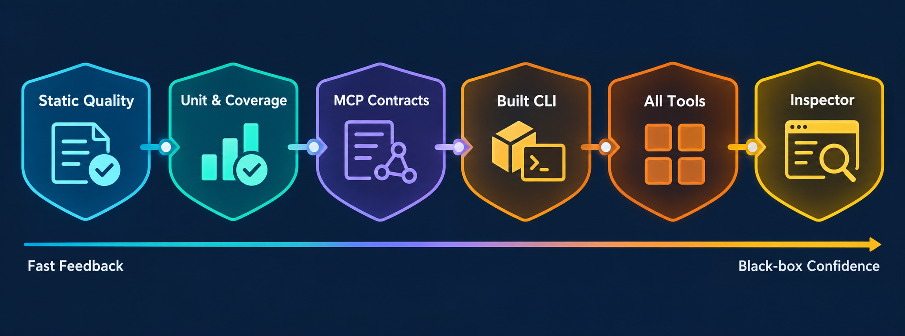

# Repository tooling

This guide explains what each repository gate proves and which commands to run for common changes. Run commands from the repository root with the Node.js and Yarn versions declared by `package.json`.



## Bootstrap

```bash
corepack enable
corepack yarn install --immutable
```

`packageManager` pins the Yarn release. Using `corepack yarn` keeps local and CI behavior aligned without duplicating the version in commands or documentation.

## Command map

| Command                            | What it proves                                                                       | Changes files           |
| ---------------------------------- | ------------------------------------------------------------------------------------ | ----------------------- |
| `corepack yarn lint`               | ESLint strict type-aware rules, imports, JSDoc, complexity, and size limits          | No                      |
| `corepack yarn lint:fix`           | Runs Prettier and safe ESLint fixes across the repository                            | Yes                     |
| `corepack yarn typecheck`          | Production and test TypeScript projects compile without emitting                     | No                      |
| `corepack yarn architecture:check` | Published-kernel boundary, colocated tests, shell-test pairing, and no import cycles | No                      |
| `corepack yarn knip`               | No unreachable files/exports or unused/undeclared dependencies                       | No                      |
| `corepack yarn test`               | Every colocated Vitest test and 95% per-file coverage                                | Coverage output only    |
| `corepack yarn test:shell`         | Every maintained Bash helper passes its isolated BATS suite                          | Temporary fixtures only |
| `corepack yarn build`              | ESM, CommonJS, CLI, and declaration artifacts package successfully                   | Replaces `dist/`        |
| `corepack yarn manifest:check`     | Checked-in feature manifest matches runtime definitions                              | No                      |
| `corepack yarn manifest:generate`  | Regenerates the checked-in feature manifest                                          | Yes                     |
| `corepack yarn test:mcp`           | Contracts plus packaged SDK, every-tool, and Inspector protocol checks               | Replaces `dist/`        |
| `corepack yarn test:live`          | Read-only packaged stdio call against a configured Backstage deployment              | Replaces `dist/`        |

## What the major tools do

### ESLint and Prettier

ESLint combines strict type-checked TypeScript rules, `@coderrob/eslint-plugin-zero-tolerance`, JSDoc checks, import sorting, unused-import detection, and SonarJS maintainability rules. Production TypeScript functions are limited to 30 lines. `.mjs` files additionally use cyclomatic complexity below 4 and a 350-line file limit. Unit tests keep the safety rules but relax return-result, anonymous-function JSDoc, and size limits.

Prettier owns mechanical formatting. Prefer a focused editor format while working; use `lint:fix` before handoff when repository-wide formatting is intended.

### TypeScript

`typecheck` runs both `tsconfig.json` and `tsconfig.test.json`. Production targets Node.js 24-era ES2024 behavior with NodeNext module resolution. The test project includes colocated Vitest files without weakening production compiler settings.

### Vitest and V8 coverage

`test` discovers `src/**/*.test.ts` and `src/**/*.spec.ts`. V8 coverage is enforced per production file at 95% for statements, branches, functions, and lines. This prevents a well-tested module from hiding an untested one.

### Architecture checker and Madge

[`scripts/check-source-layout.mjs`](../../scripts/check-source-layout.mjs) mechanically enforces the source organization described in the [architecture overview](../architecture/overview.md). Madge then rejects import cycles. Type-only declaration files are validated by TypeScript rather than runtime coverage.

### Knip

Knip treats package entrypoints, build configuration, and maintained scripts as roots. It rejects unused files, exports, dependencies, development dependencies, and undeclared imports. Executables reached through resolved command paths are narrowly documented in `knip.json`.

### BATS

Every `scripts/*.sh` file has a same-name `.bats` suite. Tests source scripts behind a `BASH_SOURCE` guard and isolate generated reports, backups, logs, and command stubs under the BATS temporary directory. `scripts/run-bats.mjs` locates Bash on Unix, honors `BASH_PATH`, or uses Git for Windows Bash.

### Rollup and manifests

Rollup emits the side-effect-free library bundles, executable CLI bundles, and TypeScript declarations. The manifest generator loads the built package and serializes the same immutable feature definitions used by the server, preventing a separately maintained tool inventory.

### MCP SDK and Inspector smoke tests

The MCP-specific scripts launch `dist/cli.cjs` as a child process. The official SDK client and Inspector communicate only over stdio; a deterministic HTTP stub records the requests that the server sends to Catalog. This proves that the test is not bypassing MCP with direct handler or HTTP calls.

## Recommended workflows

### Normal TypeScript change

```bash
corepack yarn lint
corepack yarn typecheck
corepack yarn architecture:check
corepack yarn test
corepack yarn knip
```

### Tool or MCP runtime change

Run the normal workflow, then:

```bash
corepack yarn test:mcp
corepack yarn manifest:check
```

### Shell automation change

```bash
corepack yarn lint
corepack yarn test:shell
corepack yarn architecture:check
```

### Dependency change

Follow the [maintenance and upgrade procedure](../dependencies/maintenance-and-upgrades.md), review both `package.json` and `yarn.lock`, then run every repository and MCP gate.

## Build outputs

| Artifact          | Consumer                             |
| ----------------- | ------------------------------------ |
| `dist/index.mjs`  | ESM library applications             |
| `dist/index.cjs`  | CommonJS library applications        |
| `dist/cli.mjs`    | ESM process execution                |
| `dist/cli.cjs`    | Package binary and stdio MCP clients |
| `dist/index.d.ts` | TypeScript library consumers         |

Generated build and coverage directories are not source. Diagnose failures at the earliest failing layer before rerunning the longer black-box gates.
